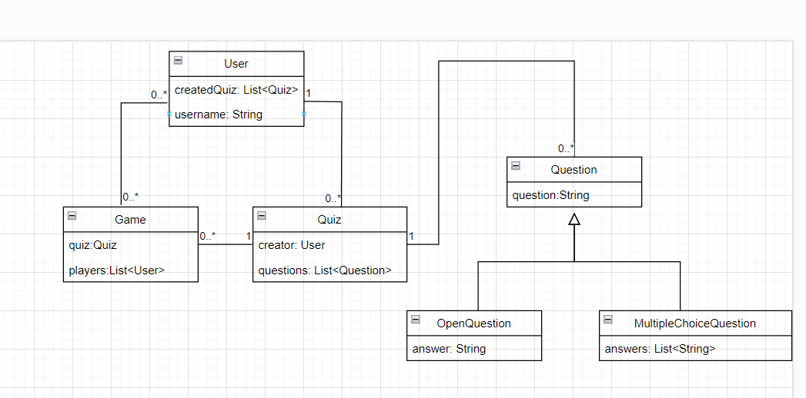

# TP 3-4 TAA
## Lucas Thébault

## Travail effectué

J'ai adapté en Spring mon TP 1-2 en utilisant le même modèle relationnel et en ajoutant des endpoints de l'API.

## Modèle relationnel

Mon modèle est simple. Il se compose de 4 entités :
- `User` : représente un utilisateur avec un nom (`username`) et la liste des quiz (`createdQuiz`) qu'il a créés.
- `Quiz` : représente un quiz d'un système comme Kahoot. Un quiz comprend son créateur (`creator` de type `User`) et la liste de ses questions (`questions`).
- `Question` : représente une question d'un quiz. Il s'agit d'une classe abstraite avec un champ `question` représentant la question qui est posée. Deux classes concrètes l'étendent :
- - `OpenQuestion` : représente une question à choix unique. Le champ `answer` correspond à la (seule) réponse correcte à la question, par exemple : `question : Quelle est la capitale de la France ?` `answer : Paris`
- - `MultipleChoiceQuestion` : représente une question à choix multiple. Le champ `answers` correspond aux réponses proposées à l'utilisateur. On peut décider par exemple que la première est la bonne réponse (et que les questions seront mélangées au front...).
- `Game` : représente une session de jeu avec son `quiz` et ses participants `players`.

En voici un schéma avec les relations :



## API

L'API est beaucoup plus complète que la version précédente. J'ai remplacé certains types de retour String par des objets ResponseEntity, permettant de choisir le code de statut HTTP souhaité.

- `POST /user` : Crée un utilisateur.
```
curl -X POST http://localhost:8080/user -H "Content-Type: application/json" -d '{"username":"Machin", "createdQuiz":[]}'
Sauvegardé ! Id = 552
```

- `GET /user?id={userId}` : Renvoie l'utilisateur d'id `userId`.
```
curl -X GET "http://localhost:8080/user?id=2" 
Aucun utilisateur avec cet id n'a été trouvé

curl -X GET "http://localhost:8080/user?id=552"
Bonjour, ton nom est Machin
```

- `GET /user?username={username}` : Renvoie l'utilisateur d'username' `username`.
```
curl -X GET "http://localhost:8080/user?username=Bidule"
Aucun utilisateur avec ce nom n'a été trouvé

curl -X GET "http://localhost:8080/user?username=Machin"
Bonjour Machin, ton id est 552
```

- `GET /user/search` : Cherche des utilisateurs par username. Voici la requête correspondante :
`@Query("SELECT u FROM User u WHERE u.username LIKE %:username%")`

```
curl -X GET "http://localhost:8080/user/search?username=Ma"
[{"id":552,"username":"Machin","createdQuizzes":[]},{"id":553,"username":"Machine","createdQuizzes":[]}]

curl -X GET "http://localhost:8080/user/search?username=L"
[]
```

- `POST /quiz` : Crée un quiz.
```
curl -X POST http://localhost:8080/quiz -H "Content-Type: application/json" -d '{"creator":{"id":552}, "questions":[]}'
Quiz créé avec succès avec l'id 452
```

- `GET /quiz/{quizId}` : Renvoie le quiz d'id `quizId`.

```
curl -X GET "http://localhost:8080/quiz/452"
{"id":452,"creator":{"id":552,"username":"Machin","createdQuizzes":[]},"questions":[]}
```

- `POST /quiz/{quizId}/addQuestion` : Ajoute une question à un quiz.
```

```
- `GET /quiz/by/{userId}` : Renvoie les id des quiz créés par l'utilisateur d'id `userId`.
```
curl -X GET "http://localhost:8080/quiz/by/552"
quiz : id : 452
```
- `GET /quiz/stats/{quizId}` : Renvoie les "statistiques" (nombre de fois que le quiz a été joué).
```
Voici la requête :
@Query("SELECT COUNT (*) FROM Game g WHERE g.quiz.id = :id")

curl -X GET "http://localhost:8080/quiz/stats/552"
Ce jeu a été joué 0 fois
```

- `POST /game` : Crée une partie de jeu.
```
curl -X POST "http://localhost:8080/game" -H "Content-Type: application/json" -d '{
  "quiz":{"id":452},
  "players": []
}'
Jeu créé avec succès avec l'id 203

Statistiques du quiz 452 après la création d'un jeu :

curl -X GET "http://localhost:8080/quiz/stats/452"
Ce jeu a été joué 1 fois
```

- `GET /game/{gameId}` : Récupère le jeu d'id `gameId`.
```
curl -X GET "http://localhost:8080/game/203"
{"id":203,"quiz":{"id":452,"creator":{"id":552,"username":"Machin","createdQuizzes":[]},"questions":[]},"players":[]}
```

- `PUT /game/join?gameId={gameId}&userId={userId}` : Permet à un utilisateur de rejoindre un jeu, c'est-à-dire de l'ajouter à la liste des joueurs pour ce jeu.
```
curl -X PUT "http://localhost:8080/game/join?gameId=123&userId=456"
Ce jeu n'existe pas

curl -X PUT "http://localhost:8080/game/join?gameId=203&userId=456"
Cet utilisateur n'existe pas.

curl -X PUT "http://localhost:8080/game/join?gameId=203&userId=552"
L'utilisateur a bien rejoint le jeu !

Si on fait un get sur le jeu, on voit que l'utilisateur a bien été ajouté :

curl -X GET "http://localhost:8080/game/203"

{"id":203,"quiz":{"id":452,"creator":{"id":552,"username":"Machin","createdQuizzes":[]},"questions":[]},"players":[{"id":552,"username":"Machin","createdQuizzes":[]}]}
```


## Problèmes et difficultés

J'ai eu beaucoup de mal à setup le projet, j'y ai passé plusieurs soirées avant de trouver la réponse auprès de l'un de mes camarades (stackoverflow et autres gpt n'ayant été d'aucun secours).
